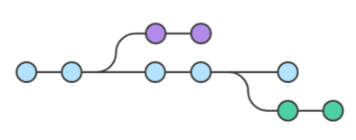

# Branch Ernesto

## Subtítulo

> Esta es una rama de prueba

Usar los siguientes comandos para pasarse a esta rama:
```
git branch e
git fetch
```

Para volver a la rama main/master:
```
git checkout master
git fetch
```


